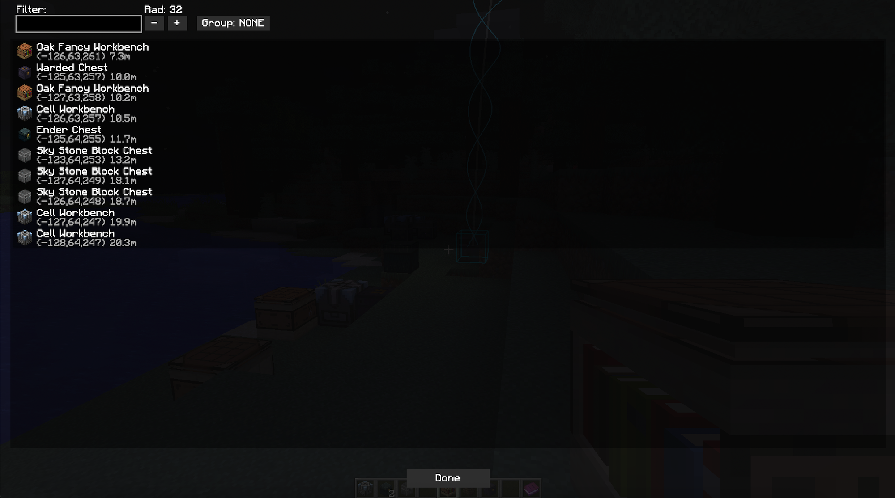
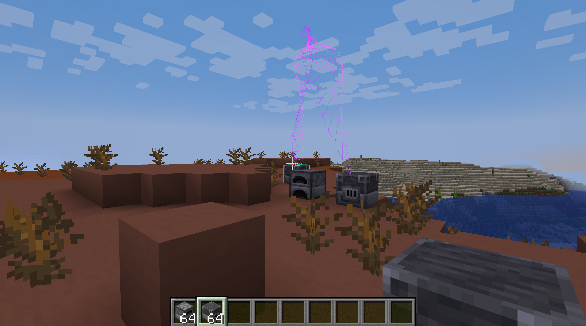
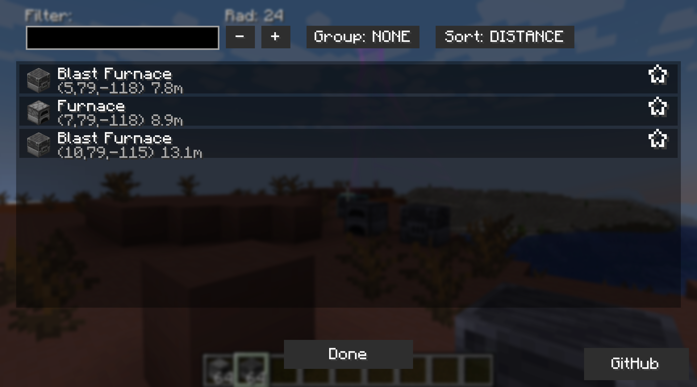

# TileFinder

[CurseForge](https://www.curseforge.com/minecraft/mc-mods/tilefinder)

For neoforge and Minecraft 1.21.1.

For the Forge 1.12.1 version, see the `1.12.1/forge` branch.

A mod for helping you locate tile/block entities in your world. Useful for modpacks with tons of random machines. Colors and helix are configurable in the mod options.

### Server-only / Vanilla Client Support
TileFinder now bundles [GooeyLibs](https://github.com/NickImpact/GooeyLibs) as a git submodule. When the mod is installed server-side only, vanilla clients (and clients without TileFinder) can use `/tilefinder [radius]` to open a chest-style inventory UI listing nearby block entities. Clicking an entry spawns a burst of particles at each location so players can find them; shift-click teleports to the nearest instance.

GooeyLibs jars are shipped in `./libs` for development; server operators should install the GooeyLibs mod jar alongside TileFinder in production.

Repo is based on https://github.com/quat1024/modern-forge-1.12-template, vibecoded with v0 and OpenAI o3.

<!--  -->
<!-- a table showing screenshot-1.png and screenhot-2.png -->

| Beam                              | GUI                               |
| --------------------------------- | --------------------------------- |
|  |  |

## Releasing

1. Run `./bump_release.sh <newVersion>` – this updates `gradle.properties`, commits, tags, and pushes.
2. GitHub Actions (see `.github/workflows/release.yml`) builds the jar and attaches it to the GitHub Release automatically.
